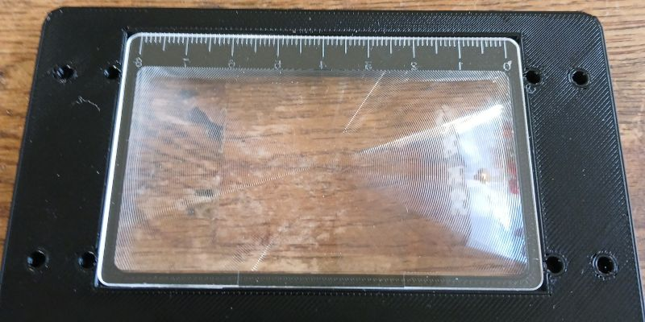
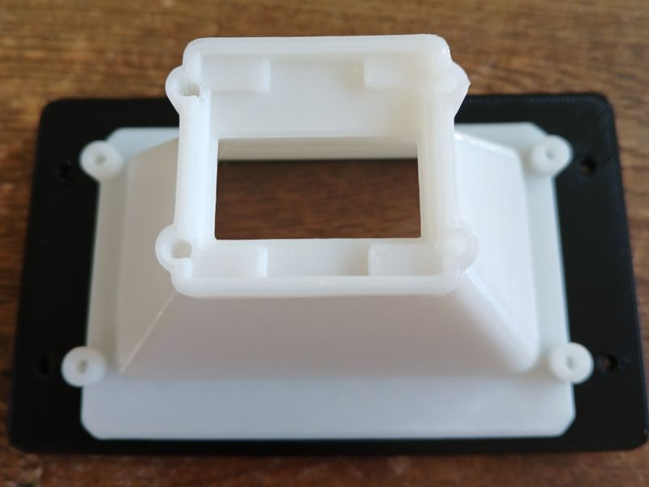
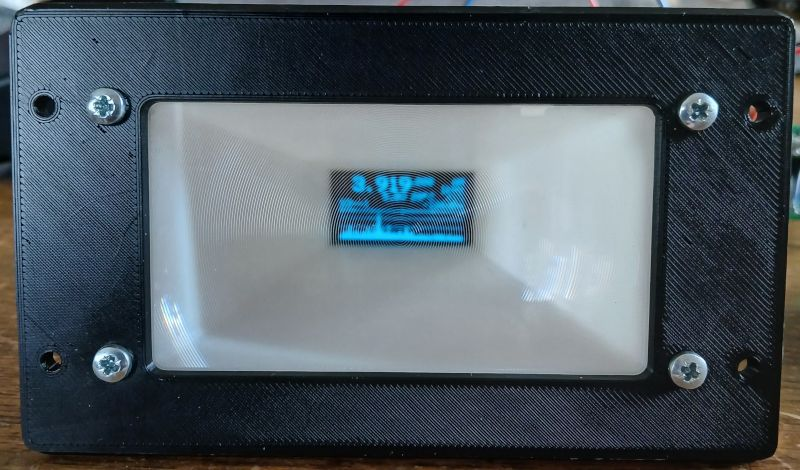
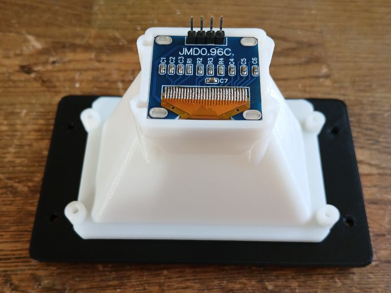
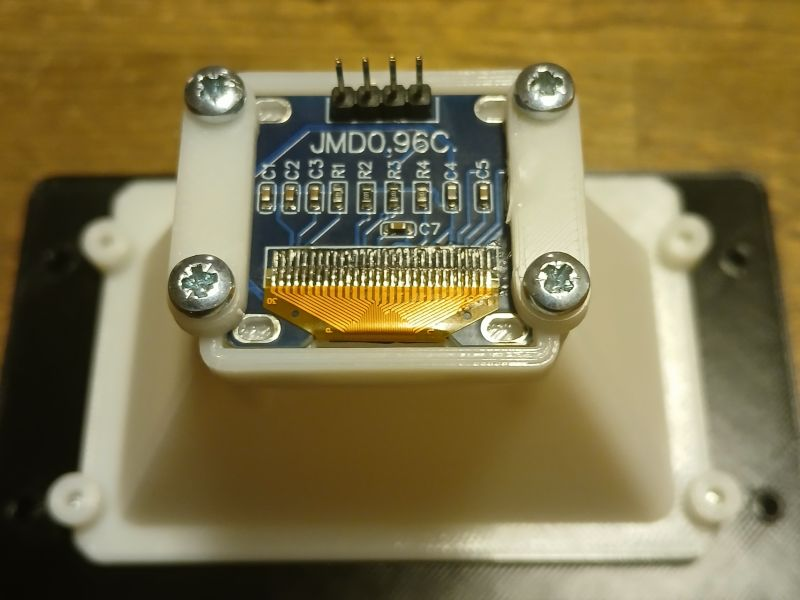

# Print and Build instructions

 
(The lens flare is not visible in person)

## Printing

When you print this you need print 1 of the `CardDisplay-Back#0.stl.zip`, 1x `CardDisplay-Front.stl.zip` and 2x `DisplayClips.stl.zip`.

The number on the end of `CardDisplay-Back#0.stl.zip` is the length from the front of the lens to the front of the OLED display in mm. To find out what length you need take your lens and hold it up to the OLED display and measure the distance that is comfortable for you.

You probably need to unzip the files before using them with your slicer.

**Note:** I have noticed that the `CardDisplay-Back#0.stl.zip` part in my black filament was too reflective for my taste so chose your filament wisely, I used a natural PLA and it is matte enough.

## Building

 

Take the Front part and place your lens in its grove.

 

Take the Back piece and place it on the Front so it covers the whole lens and turn it over.

 

Take 4 M3x10 screws and fasten the Back piece to the Front piece using the inner holes as shown. Turn it over again.

 

Place the OLED display in the slot on the Back piece of the magnifier.

 

Use the DisplayClips and 4 M3x10 screws and lock the OLED display in place.

 

A complete display magnifier with [PicoRX](https://github.com/dawsonjon/PicoRX)  running on the display.