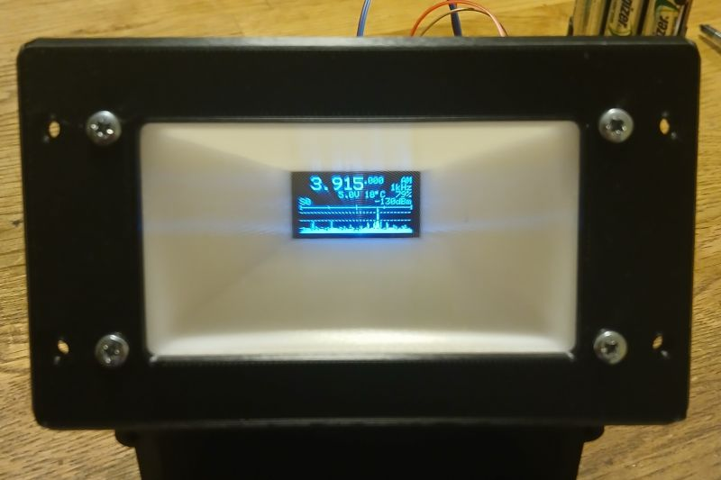

# OLED display magnifier

 

These 3D models is made to make 0.96" OLED display more readable by using a credit card sized Fresnel lens.

The model are designed in OpenSCAD.

In the file `CardDisplay-Back.scad` the variable **h** is the length from the front of the lens to the front of the OLED display in mm.

## Print and Build instructions

Read [Build.md](Build.md)

## Rendering Instructions

Rending needs the following software:

* OpenSCAD
* GNU Parallel
* advzip from advancecomp **or** zip from Info-Zip

To render run render.sh
```
$> ./render.sh
```
This will create CardDisplay.zip with all the STLs inside.
